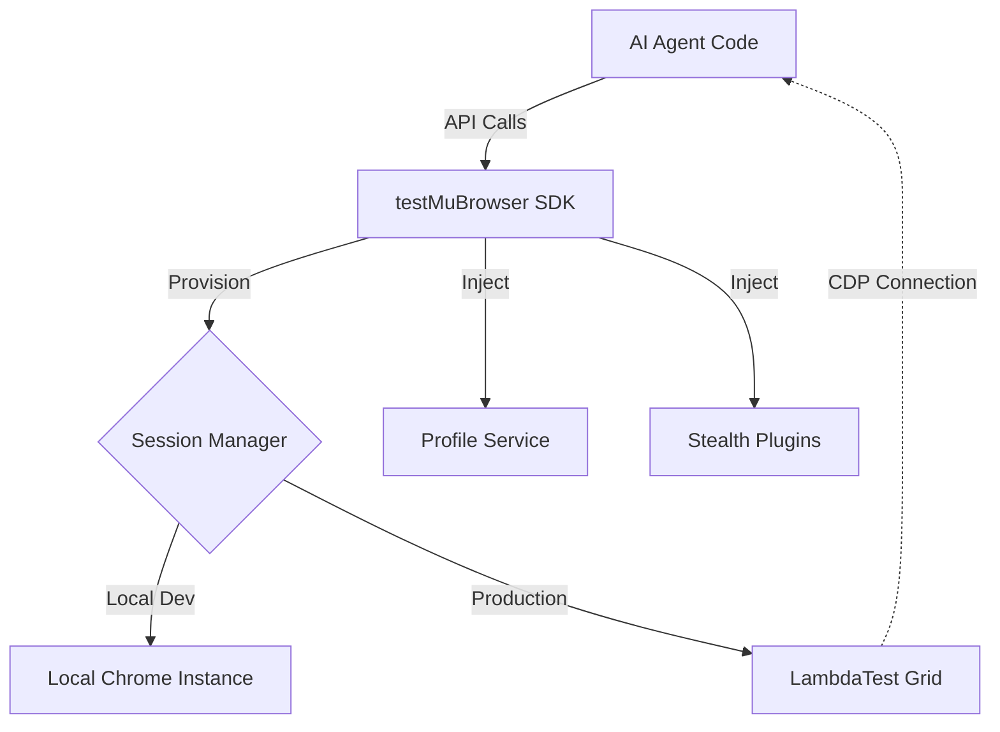

# Introduction to testMuBrowser

**testMuBrowser** is a production-grade SDK designed to bring the capabilities of **Steel.dev**—such as session persistence, advanced stealth, and agentic workflows—to the **LambdaTest** infrastructure (and local environments).

It serves as a compatibility layer that allows developers to port AI Agents written for Steel directly to LambdaTest with minimal code changes, while unlocking the massive scale of LambdaTest's global Selenium/CDP grid.

## Core Philosophy

Building AI Agents that interact with the web is difficult due to:
1.  **Anti-Bot Systems**: Cloudflare, Akamai, and Datadome block standard headless browsers.
2.  **State Persistence**: Agents need to "remember" user sessions (cookies, localStorage) across runs.
3.  **Infrastructure Scaling**: Managing 1,000+ concurrent browser containers is operationally complex.

**testMuBrowser** solves this by abstracting the infrastructure into a simple API:

## Key Capabilities

| Feature | Description |
| :--- | :--- |
| **Sessions API** | Create ephemeral or persistent browser sessions on demand. |
| **Multi-Framework** | First-class support for **Puppeteer**, **Playwright**, and **Selenium**. |
| **Stealth Mode** | Built-in evasion techniques (fingerprinting protection, user-agent rotation). |
| **Profile Persistence** | Automatically save and load cookies/storage to maintain "Logged In" state. |
| **Extensions** | Inject Chrome extensions (CRX/ZIP) into your sessions. |
| **File I/O** | Upload files for the browser to use, or download generated reports/PDFs. |
| **Hybrid Runtime** | Develop locally with zero cost, deploy to the cloud for infinite scale. |

## Comparison: Steel vs testMuBrowser

| Feature | Steel.dev | testMuBrowser (on LambdaTest) |
| :--- | :--- | :--- |
| **Infrastructure** | Managed Steel Grid | LambdaTest Grid |
| **Protocol** | CDP / WebSocket | CDP / WebSocket / WebDriver |
| **Persistence** | Cloud-managed | Local/S3-backed (Soft Persistence) |
| **Cost** | Usage-based | LambdaTest Concurrency Plan |
| **Stealth** | Proprietary | `puppeteer-extra-plugin-stealth` + Custom |

## Next Steps

*   [**Getting Started**](./getting-started.md)
*   [**Sessions API**](./sessions.md)
*   [**Persistence & Profiles**](./profiles.md)
