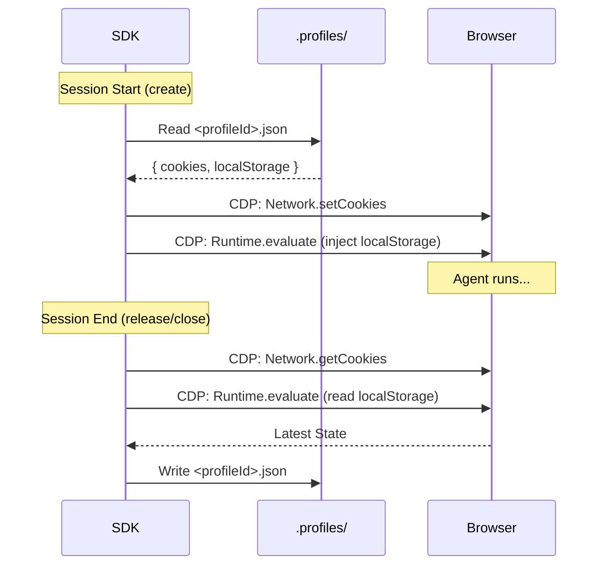

# Profiles API & Persistence

One of the biggest challenges in AI Agent development is **maintaining state**. When a human uses a browser, they stay logged in. When a standard bot runs, it starts fresh every time.

**testMuBrowser** solves this with the **Profiles API**, enabling "Soft Persistence" of browser state.

## How it Works

Profiles are JSON blobs stored in the `.profiles/` directory (or an external DB in future versions). They contain:
1.  **Cookies**: Session cookies, auth tokens.
2.  **LocalStorage**: SPA state, JWTs, user preferences.
3.  **SessionStorage**: Tab-specific temporary data.



## Managing Profiles

### Creating a Profile

Profiles are created automatically if they don't exist, but you can explicitly initialize one.

```typescript
// Create a fresh profile
await client.profiles.create('agent-alice');
```

### Listing Profiles

```typescript
const profiles = await client.profiles.list();
// ['agent-alice', 'agent-bob']
```

## Using Profiles in Code

To attach a profile to a session, simply pass the `profileId`.

```typescript
const session = await client.sessions.create({
    profileId: 'agent-alice'
});

// Any login actions performed here...
await page.login('user', 'pass');

// ...will be saved automatically when the browser closes!
await browser.close();
```

## Advanced: Profile Structure

A profile file (`.profiles/agent-alice.json`) looks like this:

```json
{
  "id": "agent-alice",
  "cookies": [
    {
      "name": "session_id",
      "value": "xyz...",
      "domain": ".example.com",
      "path": "/",
      "httpOnly": true,
      "secure": true
    }
  ],
  "localStorage": {
    "theme": "dark",
    "auth_token": "bearer eyJ..."
  },
  "sessionStorage": {}
}
```

> [!WARNING]
> **Security Implication**: Profiles contain sensitive session tokens. Ensure the `.profiles/` directory is secured or git-ignored if it contains production credentials.
